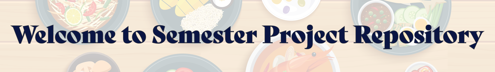

## Deliverable 12 - Phase 2 submission 

### Table of Contents

-   [Team Members Information](#️-team-members-information)
-   [Project Overview](#project-overview)
-   [Why This Project Matters](#-why-this-project-matters)
-   [Installation Instructions](#️-installation-instructions)
-   [Usage Guide](#-usage-guide)
-   [Configuration](#️-configuration)
-   [Contributing Guidelines](#-contributing-guidelines)
-   [License](#-license)
-   [Files and Folders](#️-files-and-folders)

### 🙆‍♀️ Team Members Information

Hello, we are the Cuisine Creators.

Michelle Koh - kohme\@vcu.edu📧

Sona James - jamess9\@vcu.edu📧

[Github Repository Link](https://github.com/cmsc-vcu/cmsc408-fa2024-proj-cuisine-creators.git)

### 💡Project Overview {#project-overview}

This database semseter website project is aimed at organizing and preserving family recipes. It focuses on designing a structured database schema to efficiently manage recipe data, ensuring that treasured family recipes can be stored and accessed easily at any time.

The purpose of this project is to design, develop, and implement a robust database to support the functionalities of the website. The database incorporates key entities such as recipes, ingredients, users, reviews, and nutritional facts. In addition to preserving recipes, the project encourages user interaction allowing users to provide feedback, rate recipes, and engage with the community.

The [Pitch Video](https://cdnapisec.kaltura.com/index.php/extwidget/preview/partner_id/1888231/uiconf_id/28242191/entry_id/1_0olwmkj0/embed/dynamic) provides an overview of our original project concept.

This [Design Video](https://cdnapisec.kaltura.com/index.php/extwidget/preview/partner_id/1888231/uiconf_id/28242191/entry_id/1_17xgd6ka/embed/dynamic) showcases out finalized plan and structure of the database.

The [Final Video](https://cdnapisec.kaltura.com/index.php/extwidget/preview/partner_id/1888231/uiconf_id/28242191/entry_id/1_fyli4h0w/embed/dynamic) is documents the database design and implementation of our semester project.

This HTML [report](https://github.com/cmsc-vcu/cmsc408-fa2024-proj-cuisine-creators/blob/1b05adf1032f85188846c3ac052f26d6d4e90b4a/reports/deliver-08.html) documents our domain, challenges, and proposed database solution.

### ❗ Why This Project Matters

This project matters because effective database design is critical for minimizing redundancy and ensuring data consistency. It also demonstrates how to handle complex relationships, such as recipes, ingredients, and steps. It takes the knowledge of SQL and apply it to a working website where core principles are applied like create, retrieve, update, and delete.

### 🛠️ Installation Instructions

No installation is necessary as most of this project is documentation.

### 🚀 Usage Guide

The following sections outline the key topics covered in this documentation:-

1.  **Project Overview and Key Deliverables** - project overview and links to our pitch video, design video, final video, and GitHug repository
2.  **Database Design** - Describes primary entities and attributes and visually represents the relationships between key entities
3.  **Data and the Data Definition Language (DDL)** - The DDL file initialization
4.  **DB integrity** -  Explaination of database integrity and its use of foreign keys, primary keys, and check constraints
5.  **Overview of the Tables in Our Cuisine Database** - Table of our primary entities, record count, and column count
6.  **User Interface Design** - Explaination of our design choices for our website and how they connect together
7.  **Reports: Twenty Queries** - Examples of specific queries include fetching recipes based on certain ingredients and listing the most popular recipes based on user reviews
8. **Crud Operations** - Screenshot examples of our website using CRUD
9. **Project Management** - Milestones for database design
10. **Future Considerations** - Considerations to apply later in the future
11. **Reflections on the overall project** - Feelings and reflection of things that didn't work out or could have been done

### ⚙️ Configuration

This project does not have configuration options.

### 🤝 Contributing Guidelines

No need for anymore contributions.

### 📑 License

This project uses third-party Docker images mysql:latest, phpmyadmin/phpmyadmin, and nginx:latest that have their respective licenses.

### 🗃️ Files and Folders

-   **./src** - to hold your python/flask source code.

-   **./reports** - to hold your deliverable reports. Within this folder, I recommend a consistent naming convention for files like *deliver-08.qmd*, *deliver-12.qmd*, etc.

-   **./asset** - holds the images used in the project.

-   **./db** - holds the data definition language (ddl) of our Recipe Database.

-   **./site** - holds all the php files for the website pages